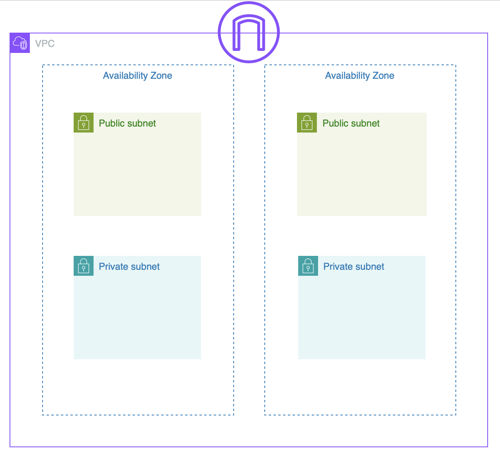

# Terraform AWS Networking Setup

This Terraform configuration sets up an AWS Virtual Private Cloud (VPC) with both public and private subnets across two availability zones. It includes optional deployment of a NAT Gateway, security groups, internet gateway, and routing configurations.



## Features

- **VPC Creation**: Creates a VPC with customizable CIDR blocks.
- **Public and Private Subnets**: Sets up two public and two private subnets across two availability zones (AZ1 and AZ2).
- **Security Groups**: Configures a default security group to allow HTTP and all egress traffic.
- **Internet Gateway**: Attaches an internet gateway for public subnets.
- **Conditional NAT Gateway Deployment**: Optionally deploys NAT Gateways in each public subnet for outbound internet access from private subnets, based on the `bool_nat_gateway` variable.
- **Routing Tables**: Sets up public and private route tables to route traffic appropriately for each subnet type.

## Prerequisites

- Terraform 0.12 or later
- AWS account with permissions to create VPC resources

## Usage

To use this Terraform module in your project, include it as a module source and point it to this GitHub repository:

```hcl
module "aws_networking_setup" {
  source = "git@github.com:Pumoxi/tf_module_aws_networking_setup.git//terraform"

  # Required Variables
  aws_vpc_cidr              = "10.0.0.0/16"
  aws_region                = "us-east-1"
  aws_az1                   = "us-east-1a"
  aws_az2                   = "us-east-1b"
  aws_public_subnet_az1_cidr = "10.0.1.0/24"
  aws_public_subnet_az2_cidr = "10.0.2.0/24"
  aws_private_subnet_az1_cidr = "10.0.3.0/24"
  aws_private_subnet_az2_cidr = "10.0.4.0/24"
  bool_nat_gateway           = true # Enable or disable NAT Gateway
}
```

As security groups requirement differs per setup, this module will only create a blank security group. Please include the configuration of security group (example as below), and customize it as per your requirement.

```hcl
resource "aws_vpc_security_group_ingress_rule" "allow_http_ipv4" {
  security_group_id = module.aws_networking_setup.security_group_id
  cidr_ipv4         = "0.0.0.0/0"
  ip_protocol       = "tcp"
  from_port         = 80
  to_port           = 80
}

resource "aws_vpc_security_group_ingress_rule" "allow_ssh_ipv4" {
  security_group_id = module.aws_networking_setup.security_group_id
  cidr_ipv4 = "0.0.0.0/0"
  ip_protocol = "tcp"
  from_port = 22
  to_port = 22
}

resource "aws_vpc_security_group_egress_rule" "allow_all_traffic_ipv4" {
  security_group_id = module.aws_networking_setup.security_group_id
  cidr_ipv4         = "0.0.0.0/0"
  ip_protocol       = "-1" # semantically equivalent to all ports
}

resource "aws_vpc_security_group_egress_rule" "allow_all_traffic_ipv6" {
  security_group_id = module.aws_networking_setup.security_group_id
  cidr_ipv6         = "::/0"
  ip_protocol       = "-1" # semantically equivalent to all ports
}
```

## Steps to Integrate

1. **Add the module to your Terraform configuration**
Copy the above module block into your Terraform file and customize the variables as needed.

2. **Initialize and apply the Terraform configuration**:
Run the following command to download the module and its dependencies, and deploy the module.

   ```bash
   terraform init
   terraform apply
   ```

3. **Variable Overview**:
If no values are provided, the module will use the default values specified in the repository.

- **`aws_vpc_cidr`**: CIDR block for the VPC (default: `10.0.0.0/16`)
- **`aws_region`**: AWS region (default: `us-east-1`)
- **`aws_az1`, `aws_az2`**: Availability zones for public and private subnets
- **`aws_public_subnet_az1_cidr`, `aws_public_subnet_az2_cidr`**: CIDR blocks for public subnets
- **`aws_private_subnet_az1_cidr`, `aws_private_subnet_az2_cidr`**: CIDR blocks for private subnets
- **`bool_nat_gateway`**: Boolean to enable or disable NAT Gateway deployment

## Outputs

Once applied, the module provides the following outputs:
- VPC ID
- Public and private subnet IDs
- Security group IDs

## Cleanup

To remove all resources, run

```bash
terraform destroy
```

**Note**: Ensure any dependent resources are removed before destroying to prevent dependency issues.